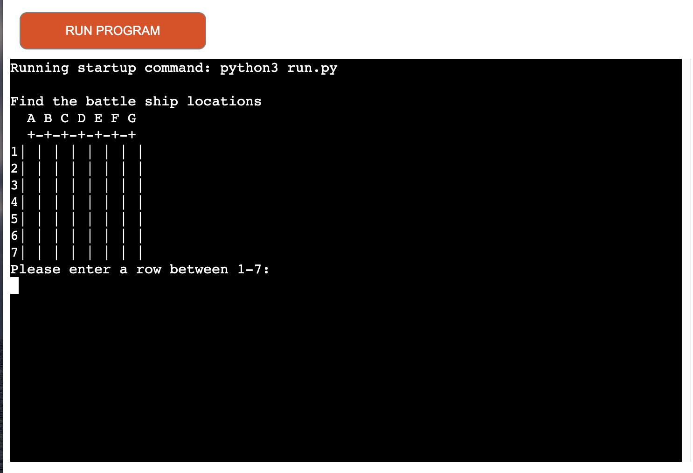

# Battle Ship Game

This is a small python project consisting of the classic game of Battle Ship. 
The project intention is to provide a simple and user friendly game.
The project is targeted against a wide range of users from all ages to provide a couple of minutes of simple entertainment.

 

## Project Goal
<li>To show the developers ability to build a responsive game using Python.</li>
 

## Target Audience
<li>People of all ages who are interested in playing the classic game for a couple of minutes of entertainment.</li>
 

# Features

## Existing Features

### Game
<li>A 7 x 7 squares game where the user has 10 attempts to hit 4 ships to win the game or else game over. The computer generates a total of 5 battle ships on a hidden board not visible for the user.</li>
  

## Potential future features to implement
 
<li>A username input to personalise the experience.</li>

# Testing

| **Type**                | **Comment (note all tests performed both pre- and post-deployment** | **Passed** |
|-------------------------|---------------------------------------------------------------------|------------|
| Game functionality      | Manual testing to generate game play.                               | Yes        |
| Result message          | Manual testing to ensure text appears as result message.            | Yes        |
| Text content            | Manual testing to ensure correct text result message appears.       | Yes        |
| Indentation and formats | Manual testing of code indentation and correct code formats.        | Yes        |

 

## Validator testing
 
<li>Code has been tested via pythontutor.org and no errors were found.</li>

 

## Fixed Bugs
 <ul>
 <li>Repaired game functionality</li>
 <li>Repaired code indentation</li>
 
 </ul>

 ## Unfixed Bugs
<li>No known bugs at this time.</li>

 

# Technology Used

## Languages
<li>Python</li>
 

## Tools and libraries
<li>https://gitpod.io - to create the game.</li>
<li>https://github.com- to host the repository and code.</li>
<li>https://heroku.com- to deploy and host the game.</li>
 

# Deployment
The site was deployed to Heroku. The steps to deploy are as follows:
<ol>
<li>In the Heroku app navigate to deployment.

 
<li>From deployment method choose Github pages and connect to your Github repository by searching and connecting for the name.

 
<li>Scroll down and select manual deploy-deploy branch.</li>

 
<li>Wait a min for the message saying "Your app was successfully deployed". Below that message is a link saying view to allow access to the live app.</li>
</ol>

 

The live link for this project can be found here - https://battle-ship-game.herokuapp.com/

 

# Credits

<li>General code was created from the developers own knowledge gained during Code Institute lessons on learning platform with particular focus on the "Love-Sandwiches" lesson but also highly influenced by the youtube video https://www.youtube.com/watch?v=tF1WRCrd_HQ by Knowledge Mavens.</li>

<li>Additionally much research, understanding and inspiration was gained from Code Institute slack forums, Stackoverflow.com, Python.org. Additional research done via the following youtube videos https://www.youtube.com/watch?v=cwpS_ac8uk0&list=PL7Kw0NTafOcwRBM4vmOJ_0vDJhDjAE8s7&index=3 by Python Ninja and  https://www.youtube.com/watch?v=MgJBgnsDcF0&list=PL7Kw0NTafOcwRBM4vmOJ_0vDJhDjAE8s7&index=4&t=256s by CS Students.

</li>
 
 

## Content
<li>The game idea is an existing classic game played both online as well as offline but all text and code is written by the developer with the help of resources and credits listed above.</li>
 

